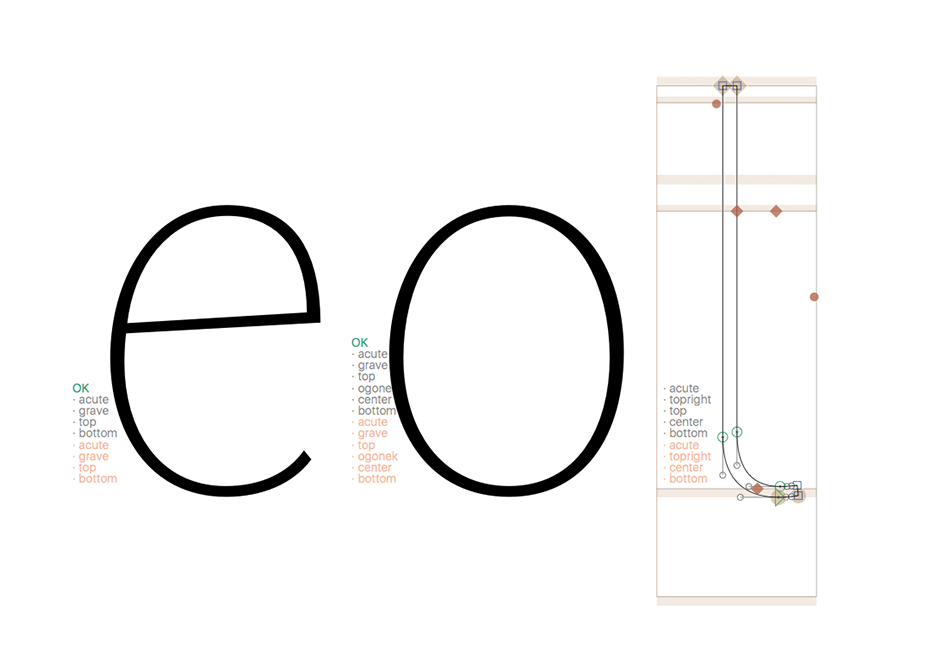

Show Next Font Anchors
==============

This plugin shows in a light orange colour the list of anchors used in the glyph of the next font and in gray colour the list of current font anchors.  
If anchors names and quantity matches between fonts it display the word "OK" in green.

### How to use:
Open two fonts and activate the plugin via **View>Show Next Font Anchors** menu item.
### Notes:
The ammount of masters of the fonts should be the same, in case of difference the plugin shows the first master only.

